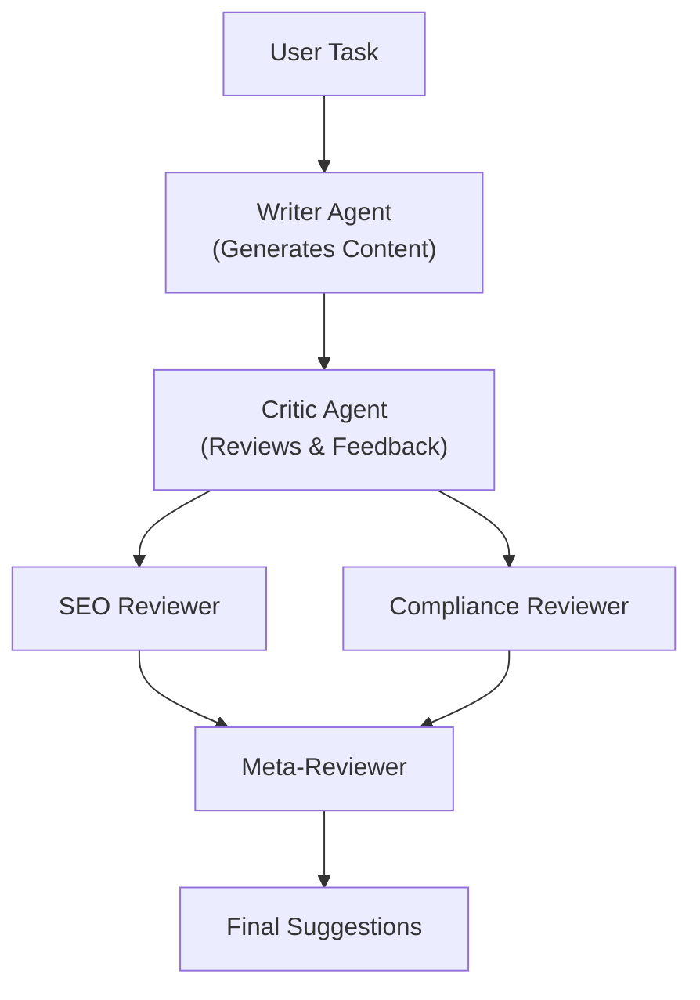

# Agentic Reflection Pattern Demo

A Streamlit-based demonstration of the Reflection Pattern in agentic workflows, using multiple specialized agents (Writer, Critic, SEO Reviewer, Compliance Reviewer, Meta-Reviewer) to iteratively improve and review generated content. Powered by AutoGen, Ollama, and local LLMs.

---

## Features
- Multi-agent orchestration for content generation and review
- Writer agent generates initial content
- Critic agent provides constructive feedback
- SEO Reviewer and Compliance Reviewer suggest improvements
- Meta-Reviewer aggregates all feedback for a final review
- Interactive Streamlit UI for entering tasks and viewing agent interactions

---

## Architecture Diagram



---

## Requirements
- Python 3.8+
- [streamlit](https://streamlit.io/)
- [autogen](https://github.com/microsoft/autogen)
- [ollama](https://ollama.com/) (for local LLMs)
- [python-dotenv](https://pypi.org/project/python-dotenv/)

Install dependencies:
```bash
pip install streamlit python-dotenv autogen
```

---

## Usage

1. Ensure Ollama is running locally and supports the required models (e.g., qwen2.5:7b).
2. Set your `OPENAI_API_KEY` environment variable (if needed).
3. Run the app:
   ```bash
   streamlit run reflection_pattern_streamlit.py
   ```
4. Enter a writing task (e.g., "Write a concise, engaging article about AI Agentic Workflows. Make sure the article is within 350 words.")
5. View the generated content, agent feedback, and final suggestions.

---

## Notes
- The system demonstrates the Reflection Pattern for agentic content improvement.
- All agents use the same LLM configuration via Ollama.
- The UI displays each agent's output and the final meta-review.

---

## License
MIT License
